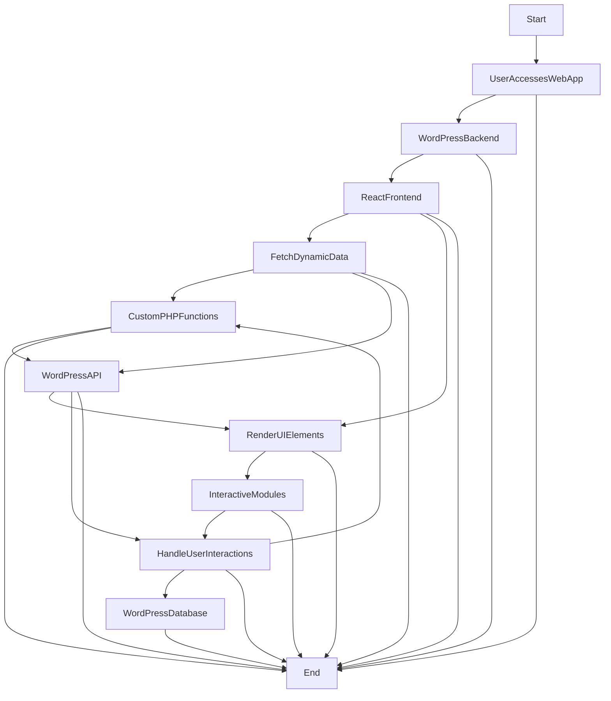

# Codetogive

Technical Overview</h2>

<h2>Problem</h2>

Lack of interactivity and accessibility features in existing games/applications that limit what a child can do and achieve.
<h2>Our Solution🔆</h2>

Provide better accessibility features and add more interactivity to help keep children engaged and optimise their imagination.
