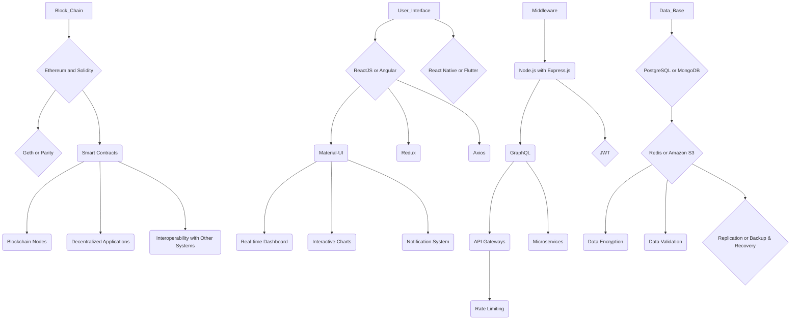

```mermaid
graph TD

 


  Block_Chain --> Ethereum_Solidity{Ethereum and Solidity}
  Ethereum_Solidity --> Geth_Parity{Geth or Parity}
  Ethereum_Solidity --> Smart_Contracts(Smart Contracts)
  Smart_Contracts --> Blockchain_Nodes(Blockchain Nodes)
  Smart_Contracts --> DApps(Decentralized Applications)
  Smart_Contracts --> Interoperability(Interoperability with Other Systems)


User_Interface --> ReactJS_Or_Angular{ReactJS or Angular}
  User_Interface --> React_Native_Or_Flutter{React Native or Flutter}
  ReactJS_Or_Angular --> Material_UI(Material-UI)
  ReactJS_Or_Angular --> Redux(Redux)
  ReactJS_Or_Angular --> Axios(Axios)
  Material_UI --> Real-time_Dashboard(Real-time Dashboard)
  Material_UI --> Interactive_Charts(Interactive Charts)
  Material_UI --> Notification_System(Notification System)
  %% User Interface

 Middleware --> Node.js_Express(Node.js with Express.js)
  Node.js_Express --> GraphQL(GraphQL)
  Node.js_Express --> JWT_OAuth{JWT}
  GraphQL --> API_Gateways(API Gateways)
  GraphQL --> Microservices(Microservices)
  API_Gateways --> Rate_Limiting(Rate Limiting)
  Data_Base --> PostgreSQL_MongoDB{PostgreSQL or MongoDB}
  PostgreSQL_MongoDB --> Redis_Amazon_S3{Redis or Amazon S3}
  Redis_Amazon_S3 --> Data_Encryption(Data Encryption)
  Redis_Amazon_S3 --> Data_Validation(Data Validation)
  Redis_Amazon_S3 --> Replication_Backup_Recovery{Replication or Backup & Recovery}

  
```
